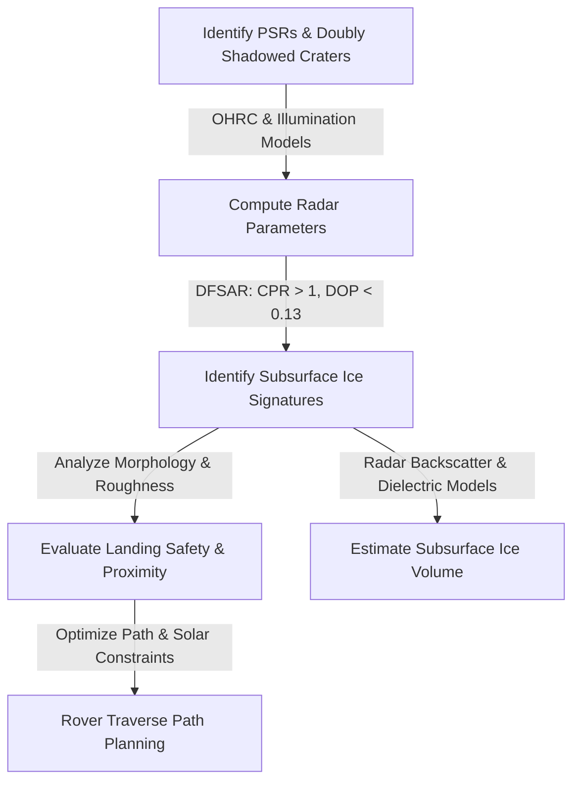

# Detection & Characterization of Subsurface Ice in Lunar South Polar Regions

> [!NOTE]
> **Chandrayaan-2 Radar and Imagery Data for Landing Site and Rover Traverse Planning**
> This problem statement addresses a critical frontier in lunar science: enabling sustained human presence by locating and accessing volatile resources (water-ice) in the harshest environments on the Moon.

---

## 📌 Problem Description
The discovery and characterization of water-ice in the lunar South Polar Region is a high-priority scientific and exploration objective, particularly for enabling sustained human presence on the Moon. 

Observations from **Chandrayaan-2** have opened new avenues to probe the surface and subsurface using high-resolution optical and radar datasets. The **"doubly shadowed craters"** in the lunar permanently shadowed regions (PSRs) provide access to some of the coldest environments on the Moon, which are ideal candidates for long-term volatile preservation. 

However, identifying subsurface ice unambiguously and translating these detections into actionable exploration strategies (landing and rover traversal) remains a key challenge.

---

## 🎯 Objectives
* **Ice Mapping:** Identify and map potential subsurface ice-bearing regions in the lunar south polar PSRs, with emphasis on "doubly shadowed craters".
* **Polarimetric Analysis:** Utilize radar polarimetric signatures to distinguish ice-rich regions within "doubly shadowed craters" from rough, rocky terrains.
* **Landing Site Selection:** Integrate terrain and illumination constraints to propose a scientifically viable and safe landing site near a "doubly shadowed crater".
* **Path Planning:** Design an optimal rover traverse path from the landing site to the target "doubly shadowed crater".
* **Volumetric Estimation:** Estimate the volume of subsurface ice within the top ~5 meters of lunar regolith at the identified "doubly shadowed crater".

---

## ⚙️ Expected Workflows & Solutions

1. **PSR Mapping:** Map permanently shadowed regions and identify "doubly shadowed craters" using illumination models and OHRC imagery.
2. **Radar Analysis:** Analyze DFSAR data to compute radar parameters such as Circular Polarization Ratio (CPR) and Degree of Polarization (DOP). Apply refined criteria (e.g., $CPR > 1$ and $DOP < 0.13$) to identify potential subsurface ice signatures.
3. **Morphological Characterization:** Study crater morphology, slopes, boulder distribution, and surface roughness using OHRC data.
4. **Landing Site Evaluation:** Evaluate terrain safety and proximity to ice-bearing regions.
5. **Path Optimization:** Design an optimal and safe path considering terrain hazards and solar power constraints.
6. **Volumetric Inversion:** Use radar backscatter models and dielectric assumptions to estimate ice concentration and volume within the top 5 meters.

---

## 📦 Datasets & Technologies

### Required Datasets
* **Chandrayaan-2 Dual Frequency Synthetic Aperture Radar (DFSAR)**
* **Chandrayaan-2 Orbiter High Resolution Camera (OHRC)**
* *Note: Participants will be supplied with Chandrayaan-2 DFSAR data of a target 'doubly shadowed crater' in the lunar south polar region.*

### Suggested Tools & Technologies
| Category | Tools & Libraries |
| :--- | :--- |
| **GIS Platforms** | QGIS, ArcGIS |
| **Programming** | Python (`NumPy`, `SciPy`, `GDAL`, `rasterio`) |
| **Image Processing** | ENVI |
| **DFSAR Processing** | MIDAS |
| **Terrain Analysis** | Digital Elevation Models (DEM tools) |
| **Path Planning** | Optimization algorithms, AI-based navigation models |
| **Visualization** | QGIS, ArcGIS, MATLAB, Python-based plotting |

---

## 🏆 Expected Outcomes & Evaluation

### Expected Deliverables
* [ ] Identification of high-probability subsurface ice regions in "doubly shadowed craters".
* [ ] A validated radar-based detection framework for subsurface ice.
* [ ] A feasible landing site near scientifically relevant targets.
* [ ] An optimized rover traverse path to access subsurface ice within the crater.
* [ ] Quantitative estimates of subsurface ice volume within the top 5 meters.

### Evaluation Parameters
> [vanilla markdown alerts format]
> **IMPORTANT**
> Submissions will be assessed based on the following criteria:
> 1. **Scientific Robustness** of the ice detection approach.
> 2. **Accuracy & Clarity** in data analysis and interpretation.
> 3. **Feasibility** of the proposed landing site.
> 4. **Efficiency & Safety** of the rover traverse design.
> 5. **Innovation** in methodology and tools used.
> 6. **Clarity** of presentation and documentation.

---

## ⏱️ Hackathon Context
During the 30 hours of the hackathon, participants must conduct detailed characterization of subsurface ice in the given "doubly shadowed crater" in the lunar South Polar Region and investigate evidence of subsurface ice beneath the floor of the crater. Subsequently, participants must design an optimal and safe rover traverse path to access subsurface ice in the "doubly shadowed crater" considering terrain hazards and solar power constraints.

---

## 🚀 Implications & Future Value
This problem statement directly contributes to future lunar exploration missions led by **ISRO** by enabling:
* **In-situ Resource Utilization (ISRU):** Locating key volatile sites for fuel and life support.
* **Strategic Planning:** Direct input for future lunar landing missions.
* **Scientific Discovery:** Improving understanding of subsurface ice distribution on the Moon.
* **Radar Remote Sensing:** Advancing planetary radar remote sensing techniques.

The outcomes could play a crucial role in shaping future robotic and human exploration of the lunar South Pole.
