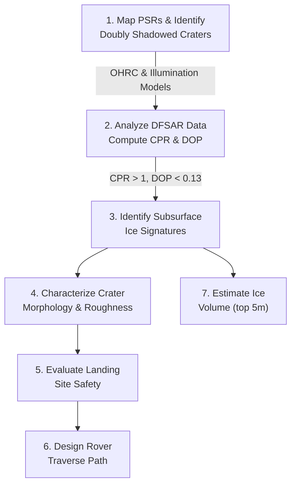

# Problem Statement #8 — Subsurface Ice Detection in Lunar South Polar Regions

> **Full Title:** Detection and Characterization of Subsurface Ice in Lunar South Polar Regions Using Chandrayaan-2 Radar and Imagery Data for Landing Site and Rover Traverse Planning  
> **Mentors:** Scientists from Physical Research Laboratory (PRL), Ahmedabad  
> **Duration:** 30-hour hackathon (Grand Finale: August 6–7, 2026)

---

## 📌 Description

The discovery and characterization of water-ice in the lunar South Polar Region is a high-priority scientific and exploration objective, particularly for enabling sustained human presence on the Moon.

Observations from **Chandrayaan-2** have opened new avenues to probe surface/subsurface using high-resolution optical and radar datasets. The **"doubly shadowed craters"** in lunar permanently shadowed regions (PSRs) provide access to some of the coldest environments on the Moon (~25 K), ideal for long-term volatile preservation.

> [!IMPORTANT]
> **Key Challenge:** Identifying subsurface ice unambiguously and translating these detections into actionable exploration strategies (landing and rover traversal) remains a key challenge.

---

## 🎯 Objectives

1. **Ice Mapping:** Identify and map potential subsurface ice-bearing regions in lunar south polar PSRs, with emphasis on "doubly shadowed craters"
2. **Polarimetric Discrimination:** Utilize radar polarimetric signatures to distinguish ice-rich regions from rough, rocky terrains
3. **Landing Site Selection:** Integrate terrain and illumination constraints for a scientifically viable and safe landing site near a doubly shadowed crater
4. **Rover Traverse Design:** Design an optimal rover traverse path from the landing site to the target crater
5. **Volume Estimation:** Estimate the volume of subsurface ice within the top ~5 meters of lunar regolith

---

## ⚙️ Expected Workflow

### Step-by-Step
1. Map permanently shadowed regions and identify doubly shadowed craters using illumination models and OHRC imagery
2. Analyze DFSAR data to compute **Circular Polarization Ratio (CPR)** and **Degree of Polarization (DOP)**
3. Apply refined criteria ($CPR > 1$ and $DOP < 0.13$) to identify potential subsurface ice signatures
4. Study crater morphology, slopes, boulder distribution, and surface roughness using OHRC data
5. Evaluate terrain safety and proximity to ice-bearing regions
6. Design an optimal and safe path considering terrain hazards and solar power constraints
7. Use radar backscatter models and dielectric assumptions to estimate ice concentration and volume within the top 5 meters

---

## 📦 Datasets

| Dataset | Source | Purpose |
|:---|:---|:---|
| **DFSAR** (Dual Frequency SAR) | Chandrayaan-2 | Radar polarimetric analysis for ice detection |
| **OHRC** (High Resolution Camera) | Chandrayaan-2 | Terrain morphology, slope, roughness analysis |
| **DEM** (Digital Elevation Model) | Derived/Provided | Terrain safety, slope calculation |

> [!NOTE]
> Participants will be supplied with Chandrayaan-2 DFSAR data of a specific doubly shadowed crater in the lunar south polar region.

---

## 🛠️ Suggested Tools & Technologies

| Category | Tools |
|:---|:---|
| GIS Platforms | QGIS, ArcGIS |
| Programming | Python (NumPy, SciPy, GDAL, rasterio) |
| Image Processing | ENVI |
| DFSAR Processing | MIDAS |
| Terrain Analysis | DEM tools |
| Path Planning | Optimization algorithms, AI-based navigation models |
| Visualization | QGIS, ArcGIS, MATLAB, Python-based plotting |

---

## 🏆 Expected Outcomes

- [ ] Identification of high-probability subsurface ice regions in doubly shadowed craters
- [ ] A validated radar-based detection framework for subsurface ice
- [ ] A feasible landing site near scientifically relevant targets
- [ ] An optimized rover traverse path to access subsurface ice
- [ ] Quantitative estimates of subsurface ice volume

---

## 📊 Evaluation Parameters

1. Scientific robustness of ice detection approach
2. Accuracy and clarity in data analysis and interpretation
3. Feasibility of proposed landing site
4. Efficiency and safety of rover traverse design
5. Innovation in methodology and tools used
6. Clarity of presentation and documentation

---

## 🚀 Implications

This work directly contributes to future ISRO lunar exploration by enabling:
- **In-Situ Resource Utilization (ISRU)** site identification
- Strategic planning for lunar landing missions
- Improved understanding of subsurface ice distribution
- Advancement in planetary radar remote sensing techniques
