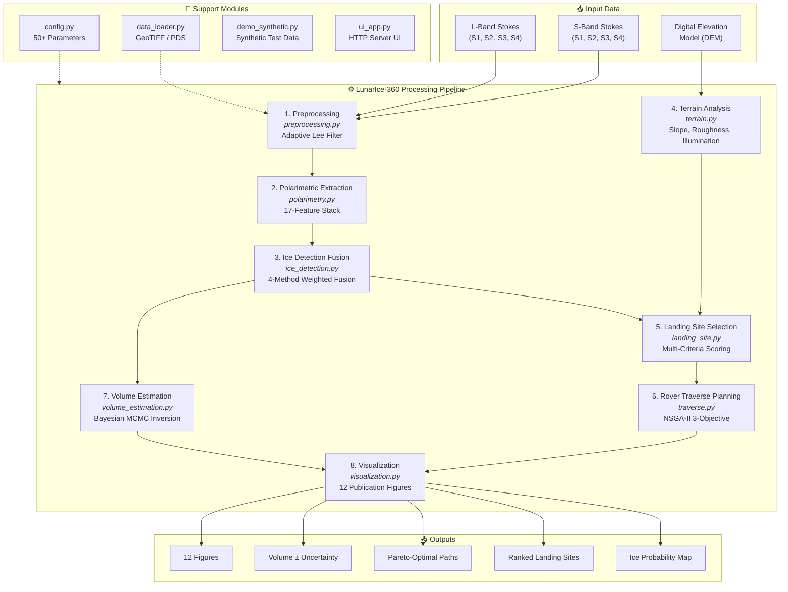

# LunarIce-360 — System Architecture

> **Project Name:** LunarIce-360  
> **Total Codebase:** ~6,400 lines of Python across 14 modules  
> **Design Philosophy:** End-to-end, fault-tolerant pipeline with inline fallbacks for every step

---

## 🏗️ High-Level Architecture



---

## 📦 Module Breakdown

### Core Pipeline Modules (8 Steps)

| Step | Module | Lines | Key Algorithm | Input | Output |
|:---:|:---|:---:|:---|:---|:---|
| 1 | `preprocessing.py` | 205 | Adaptive Lee Speckle Filter | Raw Stokes (S1–S4) per band | Filtered Stokes |
| 2 | `polarimetry.py` | 523 | H/A/α decomposition, CPR, DOP, m-chi | Filtered Stokes | 17-feature stack |
| 3 | `ice_detection.py` | 370 | GMM + Isolation Forest + Threshold + H-α fusion | Feature stack | Ice probability map |
| 4 | `terrain.py` | 437 | Slope, roughness, ray-traced illumination, Hurst | DEM | Hazard map, illumination |
| 5 | `landing_site.py` | 354 | Multi-attribute utility scoring | Ice map + terrain | Top-3 landing sites |
| 6 | `traverse.py` | 623 | NSGA-II (pymoo) | Landing site + hazard map | Pareto-optimal paths |
| 7 | `volume_estimation.py` | 664 | Bayesian MCMC (emcee) | Ice map + radar data | Volume ± uncertainty |
| 8 | `visualization.py` | 909 | 12 figure generators | All pipeline outputs | Publication figures |

### Support Modules

| Module | Lines | Purpose |
|:---|:---:|:---|
| `config.py` | 191 | Central configuration (physics, thresholds, NSGA-II, MCMC, rover specs) |
| `data_loader.py` | 471 | GeoTIFF (rasterio) and PDS/IMG (GDAL) loading with validation |
| `demo_synthetic.py` | 737 | Synthetic DEM + Stokes data generation for testing |
| `ui_app.py` | 162 | HTTP-based browser UI with async pipeline execution |
| `main.py` | 762 | Pipeline orchestrator with try/except fallbacks for every step |
| `__init__.py` | ~30 | Package-level exports |

---

## 🔄 Data Flow Detail

### Step 1: Preprocessing
```
Raw Stokes [S1, S2, S3, S4] × 2 bands
    ↓ Adaptive Lee Filter
    ↓ Î = I̅ + W·(I - I̅), W = 1 - σ²_noise/σ²_local
Filtered Stokes (speckle-reduced)
```

### Step 2: Polarimetric Feature Extraction (17 Features)
```
L-Band Features (9):
├── CPR = (S1 - S4) / (S1 + S4)
├── DOP = √(S2² + S3² + S4²) / S1
├── m-chi: Pv, Ps, Pd (Raney 2012)
├── H, A, α (analytical 2×2 eigendecomposition)
└── σ⁰ (backscatter intensity)

S-Band Features (5):
├── CPR, DOP, Pv, Ps, Pd

Dual-Frequency Features (3):
├── CPR_diff = CPR_L - CPR_S
├── vol_ratio = Pv_L / Pv_S
└── CPR_ratio = CPR_L / CPR_S
```

### Step 3: Ice Detection Fusion
```
                    ┌─ Threshold (20%): CPR > 1.0 AND DOP < 0.13
                    ├─ GMM (35%): 5-component clustering → ice cluster
Feature Stack (17) ─┤
                    ├─ Isolation Forest (25%): Anomaly detection
                    └─ H-α Zones (20%): Zones 8,9 = ice candidates
                         ↓
                    Weighted Average → Morphological Opening (3×3)
                         ↓
                    Ice Probability Map [0, 1]
```

### Step 4–5: Terrain → Landing Site
```
DEM → Slope (Sobel) + Roughness (RMS) + Illumination (Ray-trace, 216 sun positions)
  ↓
Hazard Map = w₁·slope + w₂·roughness + w₃·(1-illumination)
  ↓
Landing Score = Safety(30%) + Illumination(25%) + Proximity_to_ice(25%) + Flatness(20%)
  ↓
Greedy Non-overlapping Selection → Top-3 Sites
```

### Step 6: NSGA-II Traverse
```
3 Objectives:
  f₁ = Minimize total energy (slope-dependent)
  f₂ = Minimize cumulative hazard
  f₃ = Minimize max shadow fraction

Constraints: max_slope ≤ 20°

Parameters: pop=100, offspring=50, 200 generations, 8 waypoints
  ↓
Pareto Front → 3 selection strategies (shortest, safest, balanced)
  ↓
Energy Profile with battery state simulation
```

### Step 7: Bayesian Volume Estimation
```
Forward Model Chain:
  Ice fraction (f_ice) → Maxwell-Garnett mixing → ε_eff
  ε_eff + roughness → Fresnel + Hagfors surface scattering
  f_ice + depth → Volume scattering with attenuation
  → Predicted CPR and σ⁰

MCMC Inversion:
  4 parameters: f_ice, roughness, density, depth
  32 walkers × 5000 steps → Posterior distributions
  → Volume = f_ice × area × depth ± uncertainty
```

---

## 🛡️ Resilience Pattern

Every pipeline step in `main.py` follows this pattern:
```python
try:
    from module import function
    result = function(inputs)
except Exception:
    # Inline simplified fallback
    result = simplified_computation(inputs)
```

This ensures the pipeline **never crashes**, even if individual modules fail to import or encounter errors with specific data.

---

## 🧮 Key Physical Constants (from `config.py`)

| Parameter | Value | Source |
|:---|:---|:---|
| L-band wavelength | 0.24 m | Chandrayaan-2 DFSAR |
| S-band wavelength | 0.12 m | Chandrayaan-2 DFSAR |
| L-band penetration | 3–5 m | Estimated |
| S-band penetration | 1–2 m | Estimated |
| Ice CPR threshold | > 1.0 | Sinha et al. (2026) |
| Ice DOP threshold | < 0.13 | Sinha et al. (2026) |
| ε (ice, 40K) | 3.1 | Literature |
| ε (regolith) | 2.7 | Olhoeft & Strangway (1975) |
| Rover speed | 50 mm/s | Typical lunar rover |
| Solar power | 100 W | Design assumption |
| Battery capacity | 500 Wh | Design assumption |
