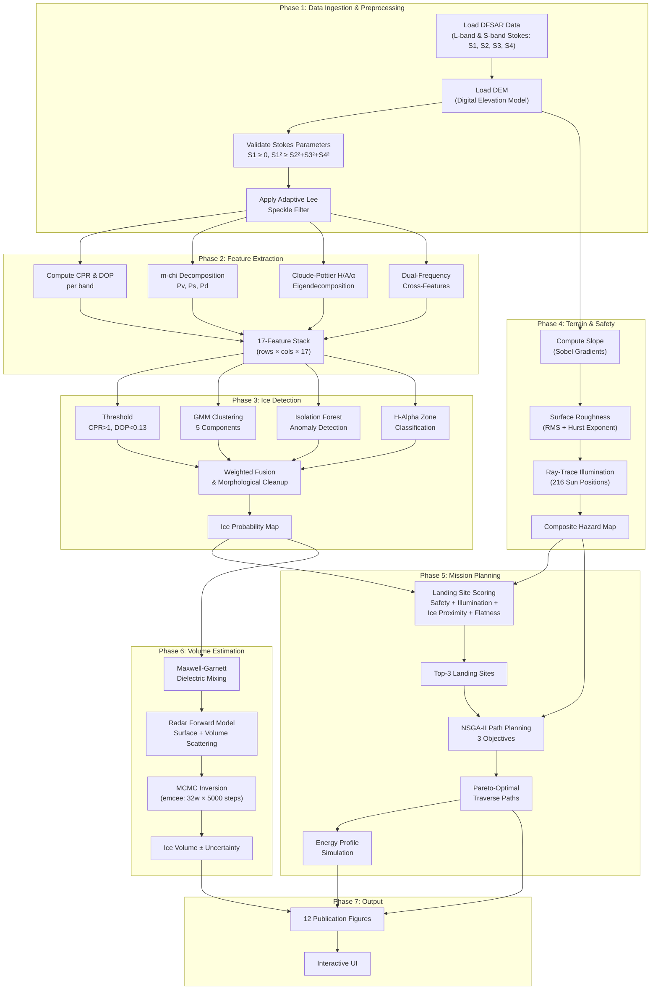

# LunarIce-360 — Approach Flow & Methodology

> Step-by-step methodology from raw data ingestion to final deliverables, with mathematical formulations.

---

## 🌊 Complete Approach Flow

---

## 📐 Mathematical Formulations

### Phase 1: Preprocessing — Adaptive Lee Filter

$$\hat{I} = \bar{I} + W \cdot (I - \bar{I})$$

Where:
- $W = 1 - \frac{\sigma^2_{\text{noise}}}{\sigma^2_{\text{local}}}$, clipped to $[0, 1]$
- $\sigma^2_{\text{noise}} = \bar{I}^2$ (single-look speckle model)
- $\bar{I}$ = local mean via uniform filter (window size 5×5)

### Phase 2: Polarimetric Features

#### Circular Polarization Ratio (CPR)
$$CPR = \frac{S_1 - S_4}{S_1 + S_4} = \frac{|E_{SC}|^2}{|E_{OC}|^2}$$

Where $S_1$ = total power, $S_4$ = circular polarization difference.
- CPR > 1 → same-sense circular dominates → **volume scattering** (ice signature)

#### Degree of Polarization (DOP)
$$DOP = \frac{\sqrt{S_2^2 + S_3^2 + S_4^2}}{S_1}$$

- DOP < 0.13 → highly depolarized → **random volume scattering** (ice)
- DOP → 1 → fully polarized → surface scattering (rock)

#### m-chi Decomposition (Raney 2012)
$$m = DOP \cdot S_1, \quad \sin(2\chi) = \frac{-S_4}{m \cdot S_1}$$

$$P_v = S_1(1-m), \quad P_s, P_d \text{ conditional on sign of } \chi$$

#### Cloude-Pottier Eigendecomposition (2×2 Analytical)

Coherency matrix from Stokes:
$$J = \begin{pmatrix} (S_1+S_2)/2 & (S_3 - jS_4)/2 \\ (S_3 + jS_4)/2 & (S_1-S_2)/2 \end{pmatrix}$$

Analytical eigenvalues:
$$\lambda_{1,2} = \frac{tr(J) \pm \sqrt{tr(J)^2 - 4\det(J)}}{2}$$

Entropy:
$$H = -\sum_{i=1}^{2} p_i \log_2(p_i), \quad p_i = \frac{\lambda_i}{\lambda_1 + \lambda_2}$$

Anisotropy:
$$A = \frac{\lambda_1 - \lambda_2}{\lambda_1 + \lambda_2}$$

Alpha (scattering angle):
$$\alpha = \arctan\left(\frac{|v_2|}{|v_1|}\right)$$

### Phase 3: Ice Detection Fusion

$$P_{\text{ice}}(x,y) = w_1 \cdot T(x,y) + w_2 \cdot G(x,y) + w_3 \cdot F(x,y) + w_4 \cdot Z(x,y)$$

Where:
- $T$ = Threshold detection (binary: CPR > 1 ∧ DOP < 0.13)
- $G$ = GMM cluster probability (normalized membership to ice cluster)
- $F$ = Isolation Forest anomaly score (rescaled to [0,1])
- $Z$ = H-Alpha zone indicator (zones 8,9 → ice)
- Weights: $w_1 = 0.20, w_2 = 0.35, w_3 = 0.25, w_4 = 0.20$

Post-processing: **Morphological opening** with 3×3 structuring element to remove isolated pixels.

### Phase 4: Terrain Analysis

#### Slope
$$\text{slope} = \arctan\left(\sqrt{\left(\frac{\partial z}{\partial x}\right)^2 + \left(\frac{\partial z}{\partial y}\right)^2}\right)$$

Gradients computed via **Sobel operator** with $8 \cdot \Delta x$ normalization.

#### RMS Surface Roughness
$$R_{\text{RMS}} = \sqrt{E[z^2] - E[z]^2}$$

Computed over sliding window via `uniform_filter`.

#### Hurst Exponent (Fractal Roughness)
Per 64×64 patch variogram at lags $l = \{1, 2, 4, 8, 16, 32\}$:
$$\gamma(l) = E[(z(x+l) - z(x))^2]$$

Linear regression on $\log(\gamma)$ vs $\log(l)$ gives slope $= 2H$.

#### Ray-Traced Illumination
For each sun position $(\theta_{\text{az}}, \theta_{\text{el}})$:
- Cast rays via array shifting
- Check if terrain blocks line-of-sight
- Average over 36 azimuths × 6 elevations = **216 sun positions**

### Phase 5: Landing Site Selection

$$S_{\text{landing}} = w_s \cdot \text{Safety} + w_i \cdot \text{Illumination} + w_p \cdot \text{Proximity} + w_f \cdot \text{Flatness}$$

Where $(w_s, w_i, w_p, w_f) = (0.30, 0.25, 0.25, 0.20)$

**Proximity score** (Gaussian around ideal distance $d_0 = 3$ km):
$$\text{Proximity}(r) = \exp\left(-\frac{(r - d_0)^2}{2\sigma^2}\right)$$

Hard constraints: slope < 10°, local max slope within 11×11 window < 8°.

### Phase 6: NSGA-II Rover Traverse

**Decision Variables:** $\mathbf{x} = (r_1, c_1, r_2, c_2, \ldots, r_n, c_n)$ — $n$ waypoint positions

**Three Objectives:**
$$\min f_1(\mathbf{x}) = \sum_{\text{segments}} \text{energy\_cost}(s) \cdot \Delta s$$
$$\min f_2(\mathbf{x}) = \sum_{\text{segments}} \text{hazard}(s) \cdot \Delta s$$
$$\min f_3(\mathbf{x}) = \max_{\text{segments}} (1 - \text{illumination}(s)) \cdot \Delta s$$

**Constraint:** $\max(\text{slope along path}) \leq 20°$

**Energy model:**
$$P_{\text{loco}}(s) = P_{\text{base}} \times (1 + \tan(\text{slope}(s)))$$

**NSGA-II Parameters:** 100 population, 50 offspring, 200 generations, SBX crossover (η=15), polynomial mutation (η=20)

### Phase 7: Bayesian MCMC Volume Estimation

**Parameters:** $\boldsymbol{\theta} = (f_{\text{ice}}, r_{\text{cm}}, \rho_{\text{kg/m}^3}, d_{\text{m}})$

**Maxwell-Garnett mixing:**
$$\varepsilon_{\text{eff}} = \varepsilon_h \cdot \frac{\varepsilon_i + 2\varepsilon_h + 2f(\varepsilon_i - \varepsilon_h)}{\varepsilon_i + 2\varepsilon_h - f(\varepsilon_i - \varepsilon_h)}$$

**Surface scattering:**
$$\sigma_{\text{surf}} = |R(\varepsilon_{\text{eff}})|^2 \cdot \cos^2(\theta) \cdot e^{-(ks)^2}$$

**Volume scattering:**
$$\sigma_{\text{vol}} = f_{\text{ice}} \cdot d \cdot \left(\frac{2\pi}{\lambda}\right)^2 \cdot 0.01 \cdot e^{-2\alpha d}$$

**Log-likelihood:**
$$\ln \mathcal{L}(\boldsymbol{\theta}) = -\frac{1}{2}\left[\frac{(\text{CPR}_{\text{pred}} - \text{CPR}_{\text{obs}})^2}{\sigma_{\text{CPR}}^2} + \frac{(\sigma^0_{\text{pred}} - \sigma^0_{\text{obs}})^2}{\sigma_{\sigma^0}^2}\right]$$

**Ice volume per posterior sample:**
$$V_{\text{ice}} = f_{\text{ice}} \times A_{\text{detection}} \times d_{\text{depth}}$$

Final estimate: median ± 16th/84th percentile credible interval.

---

## 🔁 Pipeline Execution Summary

| Phase | Duration (est.) | Output |
|:---|:---|:---|
| 1. Preprocessing | ~2 seconds | Filtered Stokes parameters |
| 2. Feature Extraction | ~5 seconds | 17-feature datacube |
| 3. Ice Detection | ~10 seconds | Ice probability map |
| 4. Terrain Analysis | ~30 seconds | Hazard + illumination maps |
| 5. Landing Site | ~2 seconds | Top-3 ranked sites |
| 6. NSGA-II Traverse | ~60 seconds | Pareto front + paths |
| 7. Volume Estimation | ~120 seconds | Volume ± uncertainty |
| 8. Visualization | ~10 seconds | 12 figures |
| **Total** | **~4 minutes** | **Complete results package** |
